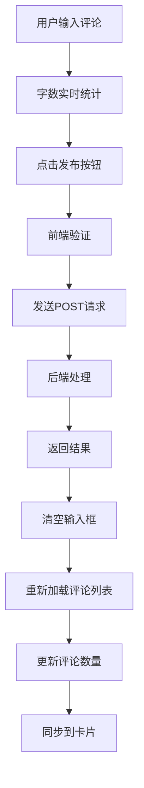

# 🎯 模态框评论功能实现

## 📋 功能概述

在帖子详情模态框中成功集成了完整的评论功能，用户可以在模态框内直接：

- ✅ **查看评论列表** - 下滑查看所有评论内容
- ✅ **发表评论** - 使用输入框快速发表评论
- ✅ **删除评论** - 管理自己的评论内容
- ✅ **实时更新** - 评论数量和状态实时同步

## 🛠️ 技术实现

### 1. **模态框HTML结构重构**

#### 原结构（点击按钮打开评论模态框）
```html
<button class="modal-action-btn comment-btn" data-post-id="${post.postId}">
    <i class="fas fa-comment"></i>
    <span class="comments-count">0</span>
    <span class="action-text">评论</span>
</button>
```

#### 新结构（集成在模态框内）
```html
<!-- 评论信息显示 -->
<div class="modal-comment-info">
    <i class="fas fa-comment"></i>
    <span class="comments-count">0</span>
    <span class="action-text">条评论</span>
</div>

<!-- 评论输入区域 -->
<div class="modal-comment-input-section">
    <div class="comment-input-container">
        <textarea id="modalCommentText" placeholder="写下你的评论..." maxlength="500" class="modal-comment-textarea"></textarea>
        <div class="comment-input-actions">
            <span class="char-count">0/500</span>
            <button type="button" class="modal-comment-submit-btn">发布评论</button>
        </div>
    </div>
</div>

<!-- 评论列表区域 -->
<div class="modal-comments-section">
    <div class="comments-header">
        <h3>评论列表</h3>
        <div class="comments-loading">加载中...</div>
    </div>
    <div class="modal-comments-list" id="modalCommentsList">
        <!-- 评论内容动态加载 -->
    </div>
</div>
```

### 2. **JavaScript功能实现**

#### 核心函数组织
```javascript
// ========== 模态框评论功能 ==========
loadModalComments(postId)        // 加载评论列表
renderModalComments(comments)     // 渲染评论HTML
createModalCommentElement()       // 创建单个评论元素
submitModalComment(postId)        // 提交新评论
deleteModalComment(commentId)     // 删除评论
updateModalCommentCount(postId)   // 更新评论数量
```

#### 事件绑定重构
```javascript
// 原来：绑定评论按钮打开新模态框
const modalCommentBtn = modalContent.querySelector('.comment-btn');
modalCommentBtn.addEventListener('click', () => {
    openCommentsModal(post.postId);
});

// 现在：绑定输入框和提交按钮
const modalCommentTextarea = modalContent.querySelector('#modalCommentText');
modalCommentTextarea.addEventListener('input', updateCharCount);

const modalCommentSubmitBtn = modalContent.querySelector('.modal-comment-submit-btn');
modalCommentSubmitBtn.addEventListener('click', () => {
    submitModalComment(post.postId);
});

// 自动加载评论
loadModalComments(post.postId);
```

### 3. **CSS样式设计**

#### 布局结构
- **输入区域** (`modal-comment-input-section`)
  - 位于点赞按钮下方
  - 独立的容器背景和边框
  - 字数统计和提交按钮

- **评论列表** (`modal-comments-section`) 
  - 固定高度400px，支持滚动
  - 加载状态提示
  - 空状态友好提示

#### 视觉特色
```css
/* 毛玻璃效果输入框 */
.modal-comment-textarea {
  background: rgba(255, 255, 255, 0.05);
  border: 1px solid var(--border-color);
  backdrop-filter: blur(10px);
}

/* 渐变提交按钮 */
.modal-comment-submit-btn {
  background: var(--primary-color);
  transition: all var(--transition-fast);
}

.modal-comment-submit-btn:hover {
  transform: translateY(-2px);
  box-shadow: 0 4px 12px rgba(102, 126, 234, 0.3);
}

/* 自定义滚动条 */
.modal-comments-list::-webkit-scrollbar {
  width: 6px;
}
```

## 🔄 数据流程

### 模态框打开流程
1. **用户点击卡片** → 触发 `showPostDetails(post)`
2. **构建模态框HTML** → 包含评论输入和列表区域
3. **绑定事件监听器** → 输入框、提交按钮、字数统计
4. **自动加载评论** → 调用 `loadModalComments(postId)`
5. **显示模态框** → 用户可立即查看和操作

### 评论操作流程


### 状态同步机制
- **模态框内评论数量** ↔ **卡片评论数量**
- **实时字数统计** → 超过限制时颜色警告
- **提交状态管理** → 按钮禁用防重复提交

## 🎨 用户体验设计

### 1. **交互优化**
- **即时反馈** - 字数统计实时更新，颜色渐变提示
- **状态管理** - 提交时按钮禁用，显示"发布中..."
- **错误处理** - 友好的错误提示和空状态展示

### 2. **视觉反馈**
```css
/* 字数警告渐变 */
.char-count {
  color: #65676b;           /* 正常状态 */
  color: #ff9500;           /* 接近限制 */
  color: #e41e3f;           /* 超出限制 */
}

/* 评论项悬停效果 */
.modal-comment-item:hover {
  background: rgba(255, 255, 255, 0.02);
}

/* 删除按钮悬停 */
.modal-comment-delete:hover {
  background: rgba(228, 30, 63, 0.1);
}
```

### 3. **响应式适配**
- **移动端优化** - 减小间距，调整字体大小
- **触摸友好** - 增大按钮热区，优化滚动体验
- **布局自适应** - 固定高度确保内容不溢出

## ⚡ 技术亮点

### 1. **模块化设计**
- 独立的模态框评论功能模块
- 与原有评论模态框共存，不影响其他功能
- 可复用的评论渲染和状态管理函数

### 2. **性能优化**
```javascript
// 避免重复DOM查询
const commentsListDiv = document.getElementById('modalCommentsList');

// 批量渲染评论
container.innerHTML = comments.map(comment => 
    createModalCommentElement(comment)
).join('');

// 异步加载，不阻塞UI
await loadModalComments(postId);
```

### 3. **错误处理**
- **网络错误** - 显示加载失败提示
- **空数据** - 友好的空状态提示
- **输入验证** - 字数限制和内容检查

### 4. **状态一致性**
- 评论操作后自动同步计数
- 删除评论后立即更新UI
- 服务器数据为权威源

## 🔧 API集成

### 复用现有接口
```javascript
// 获取评论列表
GET /api/posts/${postId}/comments

// 创建新评论  
POST /api/comments
{
  "postId": postId,
  "content": "评论内容"
}

// 删除评论
DELETE /api/comments/${commentId}

// 获取评论数量
GET /api/posts/${postId}/comments/count
```

### 数据格式保持一致
与独立评论模态框使用相同的数据结构，确保兼容性。

## 🎯 实现效果

用户现在可以在帖子详情模态框中：

1. **浏览帖子内容** → 查看完整的帖子信息和点赞
2. **向下滚动** → 自然过渡到评论输入区域  
3. **快速评论** → 在输入框中写评论，实时字数统计
4. **一键发布** → 点击按钮立即发布，无需跳转
5. **查看所有评论** → 下滑查看评论列表，支持滚动
6. **管理评论** → 删除自己的评论，实时更新

这个实现提供了流畅、直观的用户体验，将评论功能无缝集成到帖子详情中！🚀 